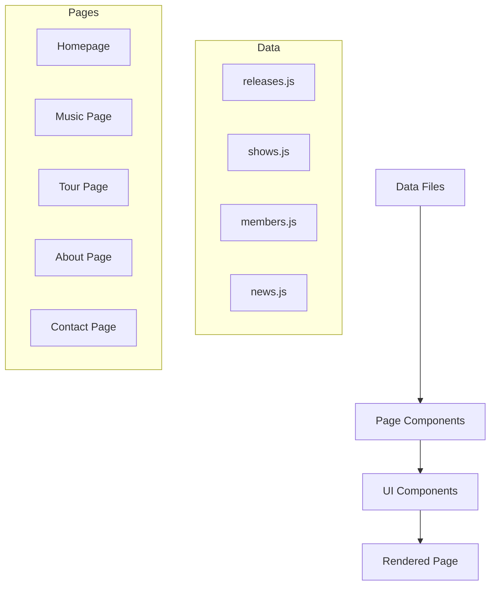

# Design Document: Band Website Redesign

## Overview

This design transforms the Imperial Garden banquet hall website into a professional band website for "The Echoes". The redesign adopts a dark, modern aesthetic with bold typography, high-contrast imagery, and smooth animations. The architecture leverages the existing Next.js/React foundation while replacing all content and styling to match the band's identity.

## Band Identity

- **Band Name**: The Echoes
- **Genre**: Indie Rock
- **Vibe**: Dark, Energetic, Modern, Authentic
- **Target Audience**: Young adults, music festival goers, indie music fans
- **Color Palette**: Black (#0a0a0a), White (#fafafa), Accent Red (#e63946)
- **Typography**: Bold sans-serif for headings (Inter Black), clean sans-serif for body (Inter)

## Architecture

### Page Structure

```
app/
├── layout.js              # Root layout with navigation and footer
├── page.js                # Homepage
├── music/
│   └── page.js            # Discography page
├── tour/
│   └── page.js            # Tour dates page
├── about/
│   └── page.js            # About/Bio page
├── contact/
│   └── page.js            # Contact/Press page
├── privacy/
│   └── page.js            # Privacy Policy page
└── globals.css            # Global styles

components/
├── layout/
│   ├── Header.js          # Site navigation
│   └── Footer.js          # Footer with social links
├── home/
│   ├── Hero.js            # Full-screen hero section
│   ├── NewsStrip.js       # Latest announcement
│   ├── UpcomingShows.js   # Next 3 shows preview
│   └── SocialFeed.js      # Social media embed (optional)
├── music/
│   ├── ReleaseCard.js     # Album/EP/Single display
│   └── SpotifyEmbed.js    # Embedded player
├── tour/
│   ├── ShowCard.js        # Individual show listing
│   └── PastShows.js       # Historical shows section
├── about/
│   ├── BandBio.js         # Band biography
│   ├── MemberCard.js      # Individual member profile
│   └── PressKit.js        # Downloadable press assets
├── contact/
│   └── ContactForm.js     # Inquiry form
└── ui/
    ├── Button.js          # Reusable button component
    └── SocialIcons.js     # Social media icon links

data/
├── releases.js            # Discography data
├── shows.js               # Tour dates data
├── members.js             # Band member data
└── news.js                # Announcements data
```

### Data Flow



## Components and Interfaces

### Header Component

```javascript
// components/layout/Header.js
const navLinks = [
  { href: '/', label: 'Home' },
  { href: '/music', label: 'Music' },
  { href: '/tour', label: 'Tour' },
  { href: '/about', label: 'About' },
  { href: '/contact', label: 'Contact' },
];

// External link
const merchLink = { href: 'https://store.example.com', label: 'Merch', external: true };
```

### Hero Component

```javascript
// components/home/Hero.js
interface HeroProps {
  backgroundImage: string;
  bandName: string;
  tagline?: string;
  ctaText: string;
  ctaLink: string;
}
```

### ReleaseCard Component

```javascript
// components/music/ReleaseCard.js
interface Release {
  id: string;
  title: string;
  type: 'album' | 'ep' | 'single';
  year: number;
  coverImage: string;
  tracks: string[];
  spotifyUrl?: string;
  appleMusicUrl?: string;
  bandcampUrl?: string;
  buyLinks: { platform: string; url: string }[];
}
```

### ShowCard Component

```javascript
// components/tour/ShowCard.js
interface Show {
  id: string;
  date: string; // ISO date
  city: string;
  venue: string;
  ticketUrl: string;
  soldOut?: boolean;
}
```

### MemberCard Component

```javascript
// components/about/MemberCard.js
interface Member {
  id: string;
  name: string;
  role: string;
  image?: string;
  bio?: string;
}
```

## Data Models

### releases.js

```javascript
export const releases = [
  {
    id: 'midnight-signals',
    title: 'Midnight Signals',
    type: 'album',
    year: 2024,
    coverImage: '/images/releases/midnight-signals.jpg',
    tracks: [
      'Into the Dark',
      'Neon Dreams',
      'Echoes',
      'Fading Light',
      'Midnight Run',
    ],
    spotifyUrl: 'https://open.spotify.com/album/...',
    appleMusicUrl: 'https://music.apple.com/album/...',
    buyLinks: [
      { platform: 'Bandcamp', url: 'https://theechoes.bandcamp.com/...' },
      { platform: 'iTunes', url: 'https://itunes.apple.com/...' },
    ],
  },
  // More releases...
];
```

### shows.js

```javascript
export const upcomingShows = [
  {
    id: 'show-1',
    date: '2025-01-15',
    city: 'Los Angeles, CA',
    venue: 'The Roxy Theatre',
    ticketUrl: 'https://tickets.example.com/...',
    soldOut: false,
  },
  // More shows...
];

export const pastShows = [
  {
    id: 'past-1',
    date: '2024-11-20',
    city: 'New York, NY',
    venue: 'Bowery Ballroom',
  },
  // More past shows...
];
```

### members.js

```javascript
export const members = [
  {
    id: 'alex',
    name: 'Alex Rivera',
    role: 'Lead Vocals, Guitar',
    image: '/images/members/alex.jpg',
  },
  {
    id: 'jordan',
    name: 'Jordan Chen',
    role: 'Bass, Backing Vocals',
    image: '/images/members/jordan.jpg',
  },
  // More members...
];
```

## Visual Design Specifications

### Color System

```css
:root {
  --color-bg: #0a0a0a;
  --color-bg-secondary: #141414;
  --color-text: #fafafa;
  --color-text-muted: #a0a0a0;
  --color-accent: #e63946;
  --color-accent-hover: #ff4d5a;
  --color-border: #2a2a2a;
}
```

### Typography

```css
/* Headings */
h1 { font-size: 4rem; font-weight: 900; letter-spacing: -0.02em; text-transform: uppercase; }
h2 { font-size: 2.5rem; font-weight: 700; letter-spacing: -0.01em; }
h3 { font-size: 1.5rem; font-weight: 600; }

/* Body */
body { font-size: 1rem; font-weight: 400; line-height: 1.6; }
```

### Component Styles

#### Hero Section
- Full viewport height (100vh)
- Background: Dark overlay (rgba(0,0,0,0.6)) over image
- Band name: Centered, uppercase, 4-6rem
- CTA button: Accent color, large padding, hover scale effect

#### Navigation
- Fixed position, transparent initially
- Background appears on scroll (glass effect with blur)
- Logo/band name on left, nav links on right
- Mobile: Hamburger menu with slide-out drawer

#### Release Cards
- Dark card background (#141414)
- Cover art: Square, hover zoom effect
- Track list: Numbered, muted text
- Player embeds: Full width within card

#### Show Listings
- Horizontal layout on desktop, stacked on mobile
- Date: Bold, accent color
- City/Venue: White text
- Ticket button: Outlined style, fills on hover

#### Footer
- Dark background (#0a0a0a)
- Social icons: 32px, hover accent color
- Copyright: Small, muted text

### Animations

```javascript
// Page transitions
const pageVariants = {
  initial: { opacity: 0, y: 20 },
  animate: { opacity: 1, y: 0 },
  exit: { opacity: 0, y: -20 },
};

// Stagger children
const containerVariants = {
  animate: { transition: { staggerChildren: 0.1 } },
};

// Hover effects
const hoverScale = { scale: 1.02, transition: { duration: 0.2 } };
```

## Error Handling

### Form Validation (Contact Page)
- Required fields: name, email, message
- Email format validation
- Inline error messages below fields
- Success message on submission

### Missing Data
- Empty shows list: Display "No upcoming shows" message
- Missing images: Use placeholder/fallback images
- External link failures: Open in new tab with rel="noopener"

## Testing Strategy

### Unit Tests
- Data formatting functions (date display, etc.)
- Form validation logic
- Component rendering with various props

### Integration Tests
- Navigation between pages
- Contact form submission flow
- External link behavior (merch, tickets)

### Visual Tests
- Responsive layouts at key breakpoints (320px, 768px, 1024px, 1440px)
- Dark theme consistency
- Animation smoothness

### Accessibility Tests
- Keyboard navigation
- Screen reader compatibility
- Color contrast ratios
- Focus indicators

## Migration Strategy

### Files to Remove
- All Imperial Garden specific components (About.js, Services.js, Packages.js, etc.)
- Banquet-related data and content
- Current color scheme and branding

### Files to Modify
- app/layout.js - Update metadata, fonts, theme
- app/globals.css - New color scheme and typography
- components/Header.js - New navigation structure
- components/Footer.js - Social links and copyright

### Files to Create
- All new page routes (/music, /tour, /about, /contact, /privacy)
- New component library for band-specific UI
- Data files for releases, shows, members
- Placeholder images in public/images/
