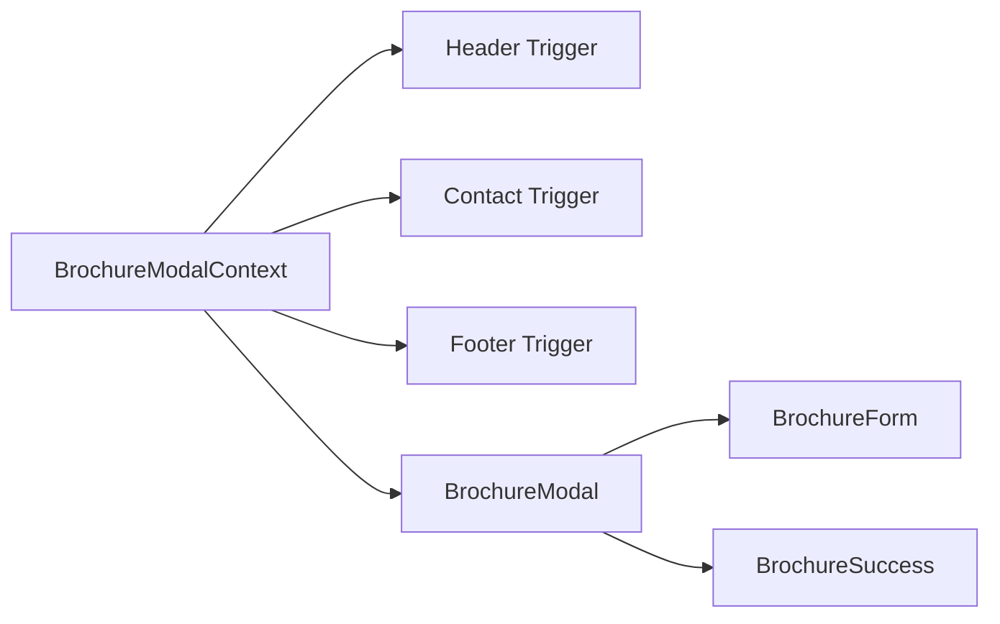
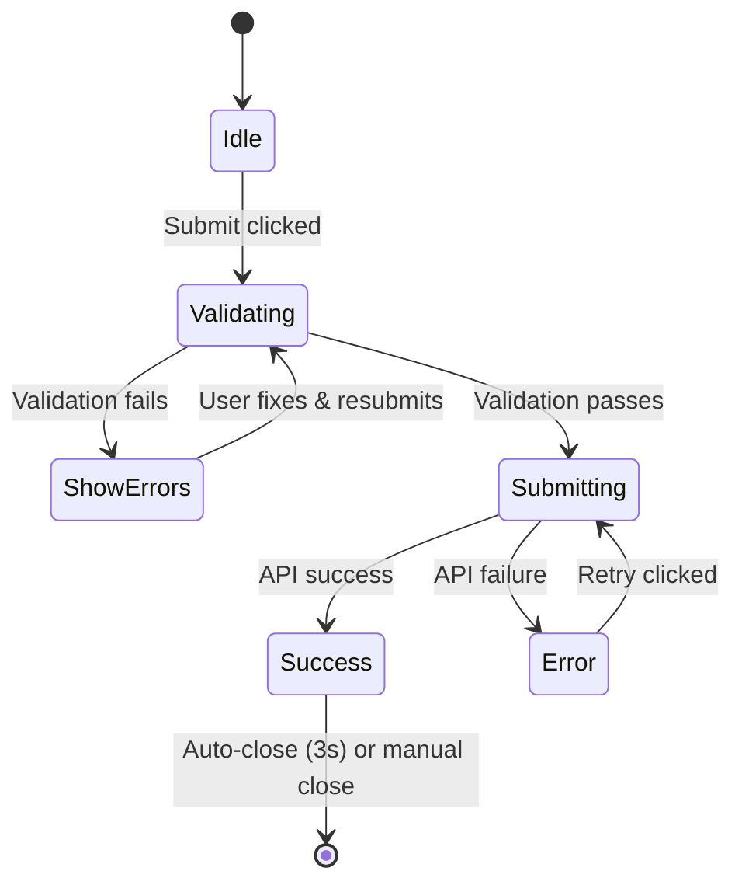

# Design Document: Concierge/Brochure Modal

## Overview

This design outlines the implementation of a full-screen brochure request modal for the Imperial Garden website. The modal provides an elegant, immersive experience for users to request the private brochure while maintaining the site's minimalist luxury aesthetic. The implementation leverages the existing Next.js/React architecture with Framer Motion for animations and Tailwind CSS for styling.

## Architecture

### Component Hierarchy

```
app/
├── layout.js (wraps with ModalProvider)
└── page.js

components/
├── BrochureModal/
│   ├── BrochureModal.js      # Main modal component
│   ├── BrochureForm.js       # Form with validation
│   └── BrochureSuccess.js    # Success state display
├── BrochureModalTrigger.js   # Reusable trigger button
├── Header.js                 # Updated with trigger
├── Contact.js                # Updated with trigger
└── Footer.js                 # Updated with trigger

contexts/
└── BrochureModalContext.js   # Modal state management
```

### State Management

The modal state is managed through React Context to allow triggers from any component:



## Components and Interfaces

### BrochureModalContext

```javascript
// contexts/BrochureModalContext.js
interface BrochureModalContextValue {
  isOpen: boolean;
  openModal: () => void;
  closeModal: () => void;
  triggerRef: React.RefObject<HTMLElement> | null;
  setTriggerRef: (ref: React.RefObject<HTMLElement>) => void;
}
```

**Responsibilities:**
- Manages modal open/close state globally
- Tracks which trigger opened the modal for focus return
- Provides context to all modal triggers and the modal itself

### BrochureModal Component

```javascript
// components/BrochureModal/BrochureModal.js
interface BrochureModalProps {
  // No props - uses context for state
}

interface ModalState {
  formState: 'idle' | 'submitting' | 'success' | 'error';
  errorMessage: string | null;
}
```

**Responsibilities:**
- Renders the full-screen modal overlay
- Manages form submission state
- Handles animations (fade in/out)
- Implements focus trap and scroll lock
- Handles close behaviors (button, backdrop, Escape key)

### BrochureForm Component

```javascript
// components/BrochureModal/BrochureForm.js
interface BrochureFormProps {
  onSubmit: (data: FormData) => Promise<void>;
  isSubmitting: boolean;
}

interface FormData {
  fullName: string;
  email: string;
  phone: string;
  eventType: string;
  message: string;
}

interface FormErrors {
  fullName?: string;
  email?: string;
  phone?: string;
}
```

**Responsibilities:**
- Renders form fields with labels
- Handles client-side validation
- Displays inline error messages
- Manages form field state

### BrochureSuccess Component

```javascript
// components/BrochureModal/BrochureSuccess.js
interface BrochureSuccessProps {
  onClose: () => void;
}
```

**Responsibilities:**
- Displays success confirmation message
- Shows close button
- Auto-closes after 3 seconds

### BrochureModalTrigger Component

```javascript
// components/BrochureModalTrigger.js
interface BrochureModalTriggerProps {
  variant: 'primary' | 'secondary' | 'text';
  className?: string;
  children?: React.ReactNode;
}
```

**Responsibilities:**
- Renders trigger button with appropriate styling
- Opens modal on click
- Registers itself as the trigger for focus return

## Data Models

### Form Submission Payload

```javascript
{
  fullName: string,      // Required, min 2 characters
  email: string,         // Required, valid email format
  phone: string,         // Required, 10 digits (with optional +91 prefix)
  eventType: string,     // Optional, one of predefined options
  message: string,       // Optional, max 500 characters
  submittedAt: string,   // ISO timestamp
  source: 'brochure-modal'
}
```

### Validation Rules

| Field | Rule | Error Message |
|-------|------|---------------|
| fullName | Required, min 2 chars | "Please enter your full name" |
| email | Required, valid format | "Please enter a valid email address" |
| phone | Required, 10 digits | "Please enter a valid 10-digit phone number" |
| eventType | Optional | N/A |
| message | Optional, max 500 chars | "Message must be under 500 characters" |

## Visual Design Specifications

### Modal Backdrop
- Background: `rgba(255, 255, 255, 0.95)` (semi-transparent white)
- Backdrop blur: `blur(8px)`
- Z-index: `50`

### Modal Content Container
- Max width: `500px` (desktop/tablet), `100%` (mobile)
- Padding: `2rem` (desktop), `1.5rem` (mobile)
- Background: `white`
- Border radius: `0` (full-screen feel)
- Box shadow: None (clean, minimal)

### Typography
- Heading: Playfair Display, 32px, font-weight 600
- Subheading: Inter, 16px, color `#666`
- Labels: Inter, 14px, font-weight 500
- Input text: Inter, 16px

### Form Fields
- Border: `1px solid #e5e5e5`
- Border radius: `8px`
- Padding: `16px`
- Focus state: `border-color: var(--color-accent)`, `ring: 2px`
- Error state: `border-color: #dc2626`

### Buttons
- Primary (Submit): Background `var(--color-accent)`, white text, full width
- Close button: `48x48px`, subtle `×` icon, top-right position

### Animations
```javascript
// Modal enter
{ opacity: 0 } → { opacity: 1 }
duration: 300ms, ease: 'easeOut'

// Modal exit
{ opacity: 1 } → { opacity: 0 }
duration: 200ms, ease: 'easeIn'

// Content slide up (optional enhancement)
{ opacity: 0, y: 20 } → { opacity: 1, y: 0 }
duration: 400ms, ease: 'easeOut', delay: 100ms
```

## Accessibility Implementation

### Focus Management
1. On modal open: Focus moves to first form field (fullName)
2. Tab navigation cycles through: form fields → submit button → close button
3. Shift+Tab reverses the cycle
4. On modal close: Focus returns to the trigger element

### ARIA Attributes
```html
<div
  role="dialog"
  aria-modal="true"
  aria-labelledby="brochure-modal-title"
  aria-describedby="brochure-modal-description"
>
  <h2 id="brochure-modal-title">Request Private Brochure</h2>
  <p id="brochure-modal-description">...</p>
</div>
```

### Scroll Lock
- On open: `document.body.style.overflow = 'hidden'`
- On close: `document.body.style.overflow = ''`
- Cleanup in useEffect return

## Error Handling

### Client-Side Validation Errors
- Display inline below each field
- Red text color (`#dc2626`)
- Appear immediately on blur or submit attempt
- Clear when user starts typing in the field

### Network/Submission Errors
- Display at form level above submit button
- Include retry button
- Message: "Something went wrong. Please try again."

### Error States Flow


## Testing Strategy

### Unit Tests
- BrochureForm validation logic
- Form field error display
- Context state management (open/close)

### Integration Tests
- Modal opens from each trigger location
- Form submission flow (success path)
- Form submission flow (error path)
- Focus trap functionality
- Escape key closes modal

### Accessibility Tests
- Keyboard navigation through form
- Screen reader announcements
- Focus return to trigger
- ARIA attributes present

### Visual/E2E Tests
- Modal appearance on desktop
- Modal appearance on mobile
- Animation smoothness
- Responsive breakpoints

## File Structure Summary

```
components/
├── BrochureModal/
│   ├── BrochureModal.js
│   ├── BrochureForm.js
│   └── BrochureSuccess.js
├── BrochureModalTrigger.js
├── Header.js (modified)
├── Contact.js (modified)
└── Footer.js (modified)

contexts/
└── BrochureModalContext.js

app/
├── layout.js (modified - add provider)
└── providers/
    └── index.js (modified - include modal provider)
```
